# Open PDF Studio Library

[](https://github.com/OpenAEC-Foundation/open-pdf-studio-library/actions/workflows/validate.yml)

**The worldwide symbol, stamp and template library for
[Open PDF Studio](https://github.com/OpenAEC-Foundation).**
Pick **region → country → sector** in the app and get a consolidated,
locally correct library package for your market: drawing symbols per your
national standards, approval stamps in your language, parametric drafting
components with your local conventions.

Everything here is drawn from scratch, versioned, validated in CI and
downloadable on demand — the app fetches a single [`index.json`](index.json)
and pulls collections as needed.

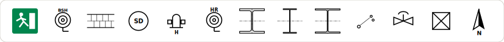

## What it looks like

Every preview below is generated straight from the repository content by
`node scripts/build-readme-media.mjs` — what you see is exactly what ships.

### 🇳🇱 `nen1414-fire` — fire safety symbols (NEN 1414 core set), 32 symbols

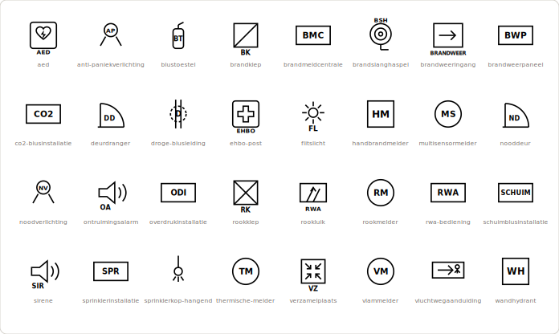

### 🇺🇸 `nfpa170-fire` — fire safety symbols (NFPA 170), 31 symbols

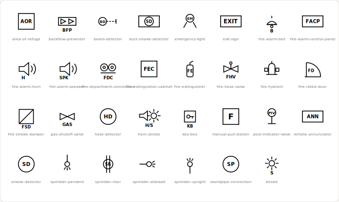

### 🇩🇪 `din14034-fire` — Feuerwehrplan symbols (DIN 14034-6), 31 symbols

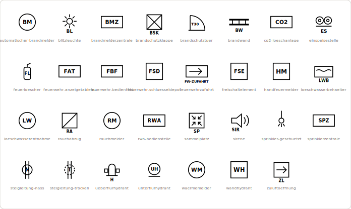

### 🇬🇧 `uk-fire-symbols` — fire safety symbols (BS 1635 conventions), 26 symbols

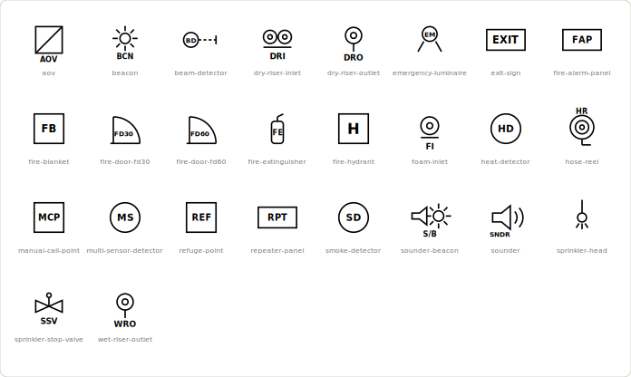

### Steel sections worldwide — real table geometry, fillets, centre lines, elevations

🇺🇸 AISC · 🇪🇺 EN 10365 (shared across Europe) · 🇬🇧 UK · 🇯🇵 JIS · 🇰🇷 KS · 🇨🇳 GB · 🇮🇳 IS 808 · 🇦🇺 AS/NZS · 🇷🇺 GOST · 🇧🇷 W series

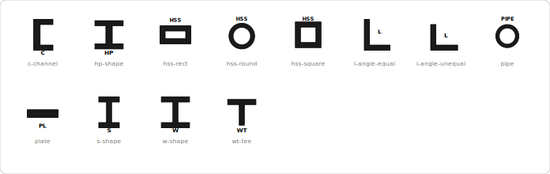
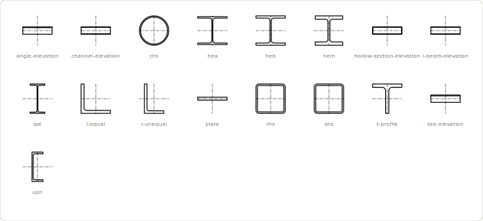
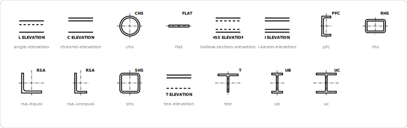
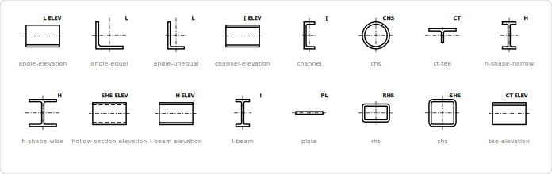
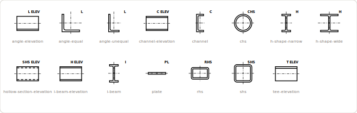
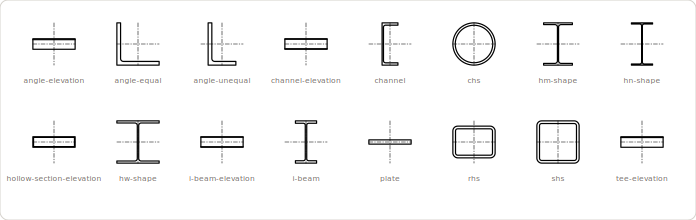
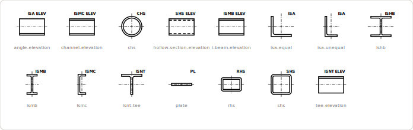
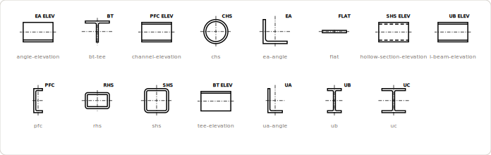
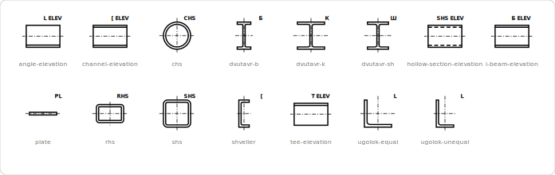
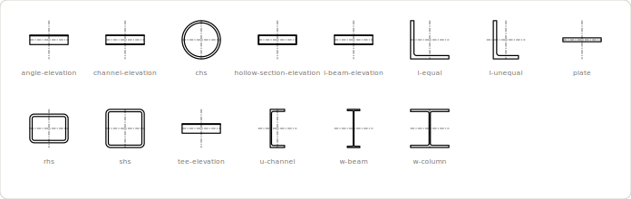

### Wall types in plan view — 🇳🇱 🇺🇸 🇩🇪 🇬🇧

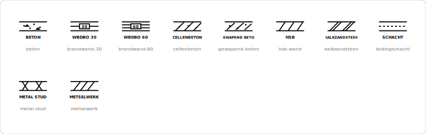
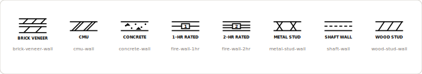
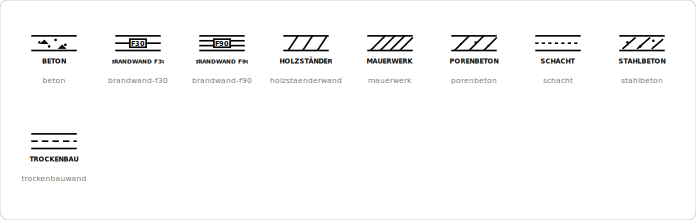
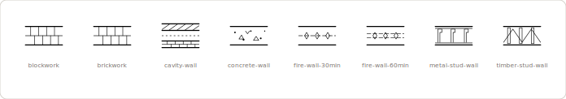

### Other sectors — electrical (IEC 60617), process (ISO 10628), HVAC

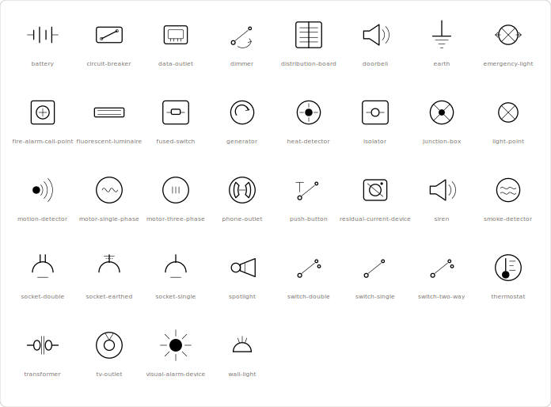
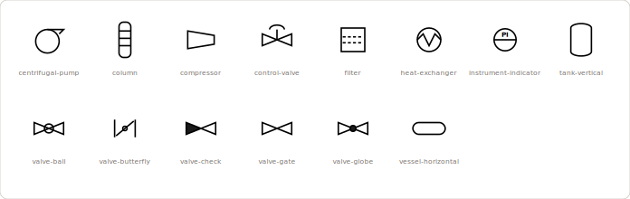
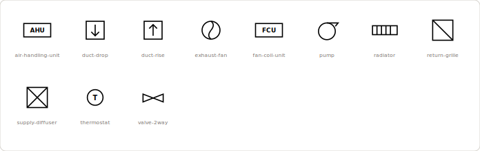

### Approval stamps — 30+ markets, in each market's own language

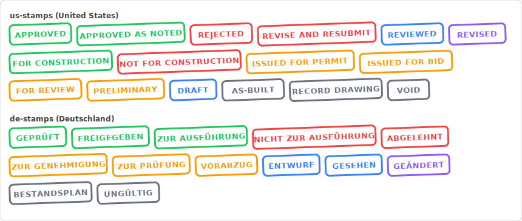

### Shared collections — used by every country

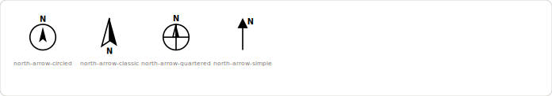

## How it works

Content exists exactly **once** as a *collection* (`collections/<id>/`);
shared standards like ISO 7010 are reused across dozens of countries.
*Country manifests* (`countries/<iso2>.json`) compose collections into one
consolidated package per sector. A generated *world index* (`index.json`)
is the only file the app fetches.

```
collections/nfpa170-fire/     ← content, drawn once
countries/us.json             ← composes the US package
index.json                    ← world index (generated)
```

Full format documentation: [docs/data-format.md](docs/data-format.md).

## Current coverage

**41 countries** across every inhabited region, including **all of Europe**.

**Full production countries** — complete national symbol sets:

| Country | What's available |
|---|---|
| 🇳🇱 Netherlands | fire safety NEN 1414 core set (32) · stamps (12) · wall types (10) · shared EN steel (17) |
| 🇺🇸 United States | fire safety (31) · stamps (16) · steel shapes incl. elevations (17) · wall types (8) |
| 🇩🇪 Germany | fire safety (31) · stamps (13) · wall types (9) · shared EN steel (17) |
| 🇬🇧 United Kingdom | fire safety (26) · stamps incl. ISO 19650 S-codes (14) · steel sections incl. elevations (15) · wall types (8) |

**Stamps ready, national symbols need local review** — the country manifest
and an authentic stamp set in the local language exist; the national symbol
set is `planned` until someone who knows the local drawings reviews it:

🇫🇷 🇮🇹 🇪🇸 🇵🇹 🇧🇪 🇦🇹 🇨🇭 🇸🇪 🇳🇴 🇩🇰 🇫🇮 🇵🇱 🇨🇿 🇸🇰 🇭🇺 🇷🇴 🇧🇬 🇬🇷 🇭🇷 🇸🇮 🇪🇪 🇱🇻 🇱🇹 🇱🇺 🇮🇪 🇲🇹 🇨🇾 🇹🇷 🇮🇱 🇷🇺 🇮🇳 🇨🇳 🇯🇵 🇰🇷 🇦🇺 🇧🇷 🇿🇦

Countries like Austria, Switzerland, Ireland, Luxembourg, Malta and Cyprus
reuse neighbouring sets where the language and standards genuinely overlap
(e.g. Switzerland composes German, French and Italian stamps).

**Every country package also includes** the shared layer: ISO 7010 safety
signs (planned), material hatch patterns (12), north arrows, electrical
installation symbols (IEC 60617, 20) — plus separate **sector packages**:
`electrical` (IEC 60617), `process` (ISO 10628 P&ID, 14) and `mep`
(HVAC, 11). Parametric drafting components (grid/level/rebar callouts,
profile sizing) are defined but waiting on the parametric format — see the plan.

The full rollout plan — four waves, from the largest construction markets to
worldwide coverage, plus future sectors (MEP, electrical, process/P&ID,
infrastructure) — lives in [MASTERPLAN.md](MASTERPLAN.md).

## 🌍 Help build your country's library

This library only becomes truly worldwide with people who know their local
market. **If you work in AEC anywhere in the world, you can make Open PDF
Studio speak your country's drawing language** — usually in a weekend:

- **Adopt a country** — create the manifest and define which national
  collections it needs. A thin national layer on top of the shared ISO/EN
  collections is often just 2–3 collections.
- **Draw a collection** — fire safety plan symbols, drafting conventions,
  material hatches. Stroke-based SVG, 64×64, guidelines in
  [docs/data-format.md](docs/data-format.md).
- **Add your stamps** — the approval stamps used on drawings in your
  language (`APPROVED` / `GEPRÜFT` / `BON POUR EXÉCUTION` / …) are a
  15-minute JSON file — see an example in
  [`collections/de-stamps/stamps.json`](collections/de-stamps/stamps.json).
- **Review** — you know what real drawings in your market look like?
  Reviewing a proposed collection is just as valuable as drawing one.

Start with [docs/contributing-content.md](docs/contributing-content.md),
or simply [open a country request](https://github.com/OpenAEC-Foundation/open-pdf-studio-library/issues/new?template=country-request.yml)
and tell us what's used on drawings where you work. Every symbol is drawn from scratch — no content is ever copied
from standards documents, so contributions stay clean.

## Tooling

```bash
npm install
npm test              # unit + repo-integrity tests
npm run validate      # schema + cross-reference + SVG checks
npm run build-index   # regenerate index.json
```

CI runs all three on every push and PR.

## Legal

All symbols are drawn from scratch to convey the meaning defined by the
referenced standards (ISO, EN, NEN, DIN, NFPA, BS, AISC, …). No content is
copied from standards documents. See [LICENSE](LICENSE).
